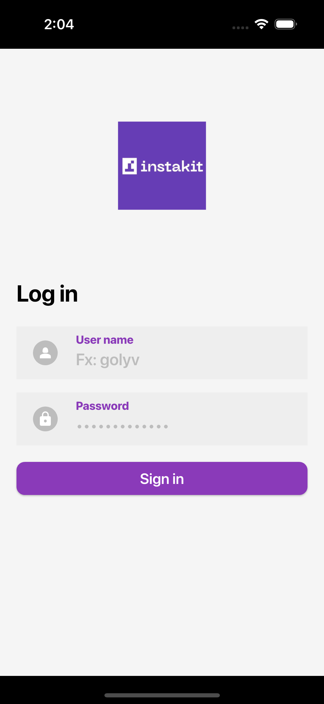
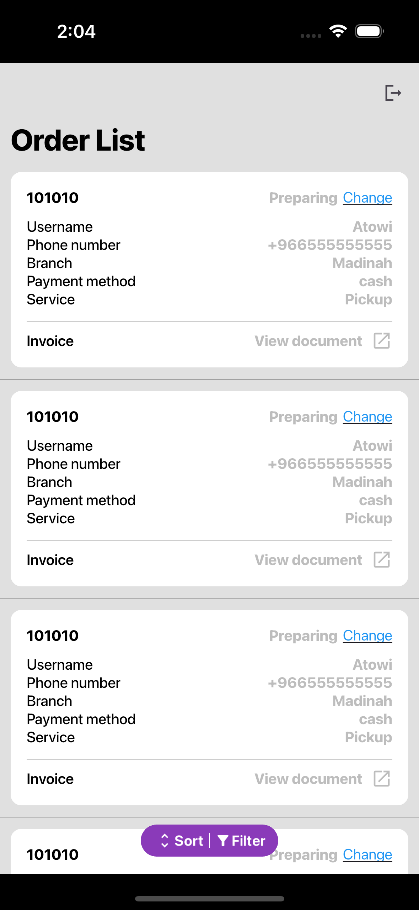
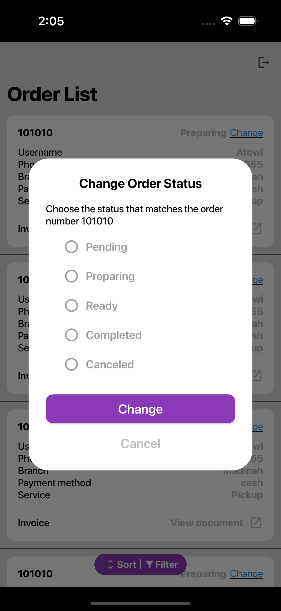
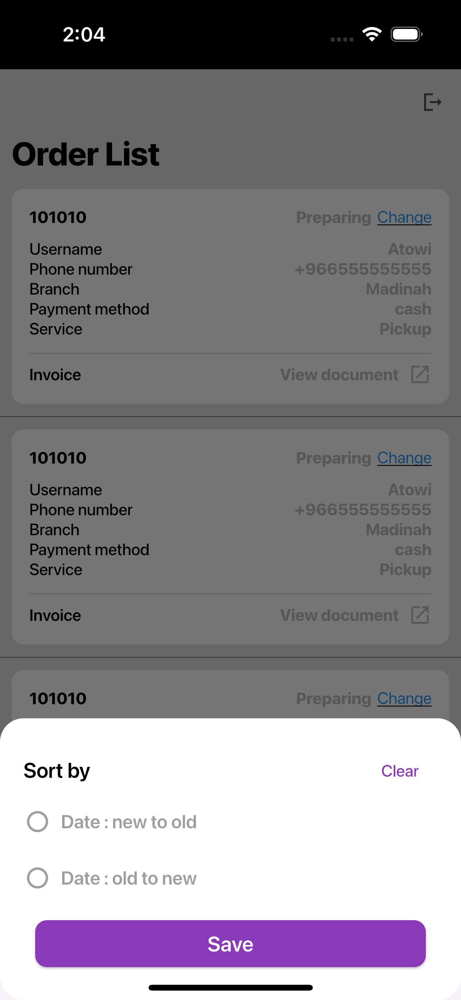

# Order System Admin App

This is an admin app for managing orders, built with Flutter and Provider for state management.

## Features

* View a list of orders with details such as:
    * Order ID
    * Username
    * Phone number
    * Branch
    * Payment method
    * Service type
* Filter orders by:
    * Order status (pending, ready, completed, canceled)
    * Payment method (cash, credit card, Mada, Apple Pay, STC Pay, Wallet)
* Sort orders by date (new to old, old to new)
* View order details, including:
    * Order status with a visual progress bar
    * Pickup branch
    * Payment method
    * Pickup date and time
    * Recite (itemized list of items ordered)
    * Subtotal
    * VAT
    * Total
    * Tax recite
* Change order status
* View invoice

## Screenshots

### Login screen: 

### Home screen: 

### Order Change Stats screen:
 
### Order details screen: 

### Filter options:
 
### Sort options: 

## Dependencies
* Provider

## Usage

1. Log in with your admin credentials
2. View the list of orders
3. Filter and sort orders as needed
4. View order details
5. Change order status
6. View invoices
